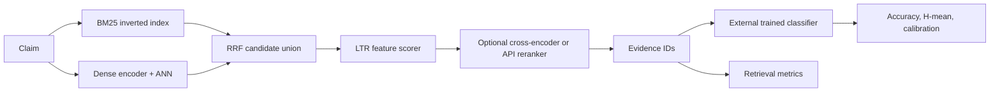

# Architecture

## Goal

The package isolates retrieval quality from claim classification quality. It preserves the course prediction schema while preventing an unconfigured classifier from inventing a label.

## Interfaces

- `EvidenceDocument`, `Claim`, `RankedDocument`, and `Prediction` normalize JSON/JSONL inputs and outputs.
- `BM25Index.search()` and `DenseRetriever.search()` return the same ranked type.
- `reciprocal_rank_fusion()` consumes named lists without assuming score calibration.
- LTR consumes persisted ordered feature names; the artifact names its real algorithm.
- Rerankers share `rerank(query, candidates, top_k)`. Cloud credentials come only from environment variables.
- Evaluation accepts prediction files, decoupling the scorer from a private classifier runtime.

## Five-stage experiment

`evaluate --experiment-config` loads fixed BM25, dense, and LTR artifacts, then runs:

1. BM25 top-K;
2. dense ANN top-K;
3. BM25+dense RRF;
4. LTR over fused candidates;
5. LTR candidates plus the configured reranker.

All stages share claim IDs and `final_k`. Per-claim rows support paired bootstrap. The actual reranker name is recorded, so a deterministic smoke fallback cannot be mistaken for Qwen3.

## Scaling boundary

JSONL and optional `ijson` parsing stream evidence. Dense indexing currently materializes metadata and one NumPy embedding matrix, so the Spartan job requests enough CPU RAM and stores the reusable matrix under project storage. A sharded encoder can later replace this without changing retrieval or evaluation contracts.

## Failure behavior

- Duplicate evidence IDs fail index construction.
- Reused embeddings fail closed if encoder, dimension, document count, or ordered ID hash differs.
- IVF-PQ rejects incompatible dimensions and undersized training sets.
- Missing FAISS, LightGBM, Sentence Transformers, FastAPI, or YAML support produces an actionable dependency error.
- A missing classifier is exposed as `not_configured`; no heuristic label is substituted.

