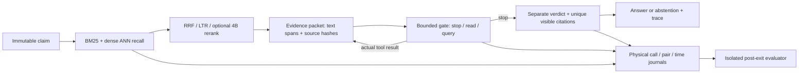

# Climate Evidence Retrieval: application case and interview handoff

## Business problem and personal contribution

A climate claim checker needs evidence that covers the claim's entity, quantity,
time and conditions, then an answer whose citations support its judgment. A
plausible answer with legal citation IDs is insufficient. I extended a course
team retrieval system with grouped hard-negative training, representation
adaptation, ANN/rank selection, evidence contracts and a bounded acquisition
prototype. The original team project is not wholly my individual contribution.

## One-page architecture

This is the project capability map, not a claim that the latest Runpod matrix
ran every component. That matrix used BM25 over 5,240 public passages; dense/ANN
and trained LTR belong to separate verified search experiments. Its adaptive
gate offered read/query, not rerank. Semantic citation support remains unmeasured.

## Results that can be used, with their exact scope

- **Restricted offline dev:** 1,208,827 documents, 154 queries. Claim-grouped
  hard-negative InfoNCE/LoRA, 20 adaptation steps, improves dense Recall@5
  **.2793→.2970**, MRR@10 **.3633→.3869**, nDCG@10 **.2994→.3203**, Evidence F1
  **.07253→.07544**; 5,000 paired intervals positive. Task adaptation, not
  pretraining, independent test or A/B. Raw remote materials inaccessible now;
  published result retained rather than recreated.
- **Public search validation:** 126 queries, fixed candidate pools. LTR achieves
  Recall@5 **.6054**, Evidence F1@5 **.3828**, warmed serial P95 **77.8 ms**;
  rerank100 reaches **.6275/.3969** but P95 **9.30 s** and its paired quality
  intervals cross zero. rerank20 yields **.5948/.3829**, P95 **1.91 s**. Select
  the low-latency LTR profile; this is not HTTP SLA or a monetary saving.
- **Runpod Agent development:** all160 slots recovered; fixed multiquery binary
  correctness **14/23** versus autonomous **8/23**. Autonomous makes zero
  acquisitions and uses more generator tokens (**3520.63 vs2088.53/request**).
  Reject promotion. Recovery and reliable execution do not establish Agent benefit.

Source: [representation result](verified-runs/qwen3-embedding-lora-full-gate-20260821.json),
[search tradeoffs](verified-runs/search-tradeoffs-20260927.json),
[latest full comparison](RUNPOD_RECOVERY_AND_NEXT_DECISION_20261003.md).
Three protocols/samples are separate; their metrics must never be pooled.

## Real behavior cases, including missing evidence

The latest actual model stops then invokes its verifier on every task. The
accepted first-case audit shows a wrong label despite three valid visible
citations: legal IDs do not prove entailment. Four duplicate-citation failures
across three tasks are repaired through real additional verdict calls. Fixed
multiquery adds25 evidence passages to final contexts across the cohort, but that
is not an autonomous acquisition case or a semantic-quality proof.

There is **no latest real autonomous acquire→new evidence→next decision case**,
no evaluated reasonable-stop success, and no actual empty/failed acquisition
recovery case. Existing synthetic empty/timeout tests exercise wiring only.
The private originals are available for authorized review; public replay exports
counts, not task text/gold. No invented examples fill these gaps.

## Two-minute STAR

**Situation:** 气候查证需要找全证据并给出有依据的结论，原系统检索和引用合法性
容易被误当成事实判断质量。

**Task:** 我负责把检索扩展成可复现的训练与选型案例，并实现受约束的证据获取原型，
验证它相对固定工作流是否有价值。

**Action:** 按claim和共享证据分组，挖掘BM25/dense hard negatives，以InfoNCE/LoRA
做任务适配；用配对bootstrap比较召回、排序与证据F1，再结合时延选LTR或4B精排。
获取原型保持原声明不变，通过typed actions、动态schema和共享预算执行查询/补读，
记录真实输入、输出、工具反馈、模型调用与引用。Spartan不可访问后，我复用本地归档，
从已回收Runpod轨迹读取行为，没有用重新推理冒充旧结果。

**Result:** 百万语料offline dev召回提升1.76个百分点；公开搜索validation中选择
77.8ms P95的LTR方案，因为9.30s的深度精排没有稳定的联合质量优势。Agent五路
160槽完整运行，但自主路线32次都停止，8/23低于固定多查询14/23，因此没有上线或
认领收益。下一步先统一排序工具权限和最终判定接口，再做公平对照。

**可迁移的判断：**我的交付是训练、检索质量/时延取舍、可核验的工具协议及真实负结果；
没有把代码运行、合法引用或更多工具调用包装成自主Agent效果。

## Two candidate resume bullets (no current resume edit)

1. **检索模型训练：**面向120.9万条气候证据，实现claim分组与BM25/dense
   hard-negative mining，采用InfoNCE/LoRA任务适配；在154条offline dev声明上
   将Recall@5从27.93%提升至29.70%，并通过5,000次配对bootstrap验证。
2. **排序与证据工程：**构建ANN、RRF/LTR与4B精排链路，在公开validation选定
   Recall@5为60.54%、离线P95为77.8ms的LTR方案；实现有界查询/补读、来源与引用
   校验及CPU轨迹回放，真实对照未证明自主获取收益，保留固定多查询基线。

Cannot claim: production adoption, online SLA/A/B, financial ROI, independent
test adaptation gain, semantic-grounded Agent improvement, recovered unavailable
remote originals, or large-scale pretraining. Resume wording follows evidence
rules and is handed to the career coordinator, not written into shared materials.
